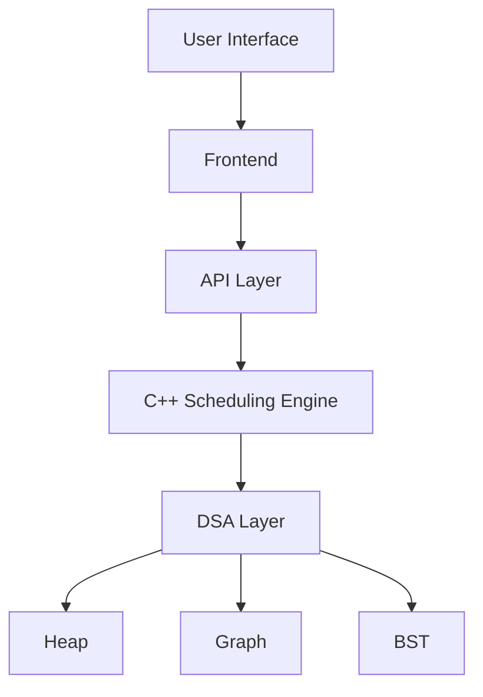
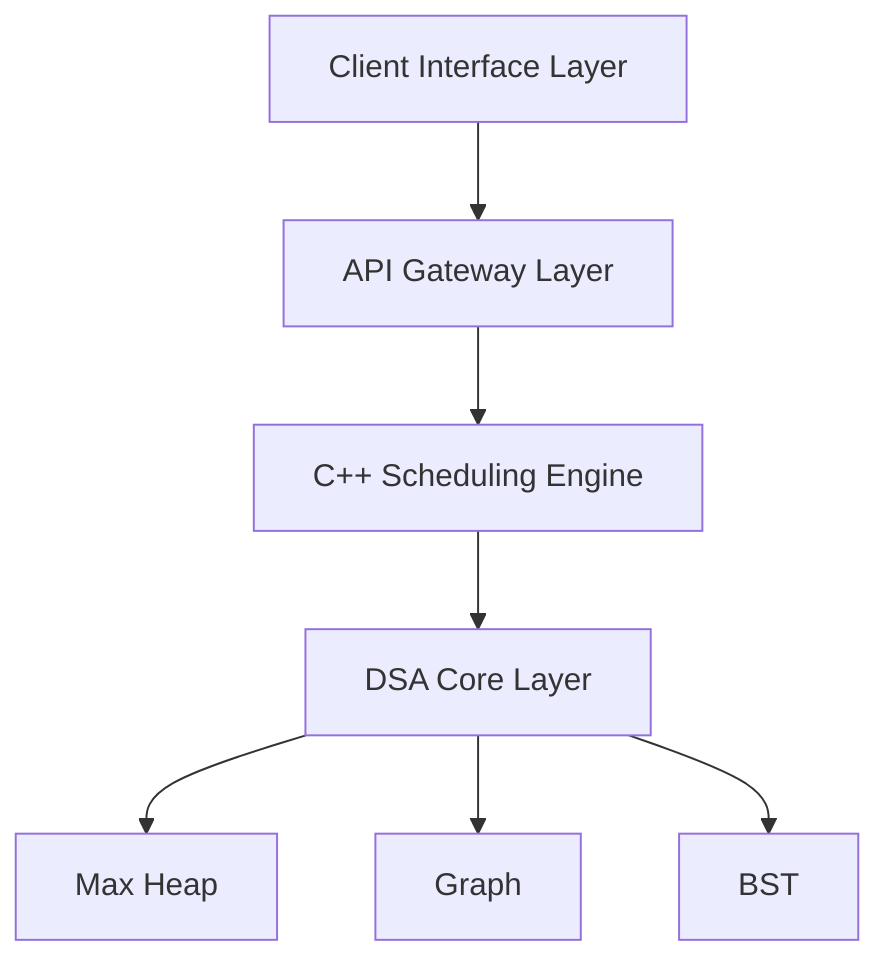
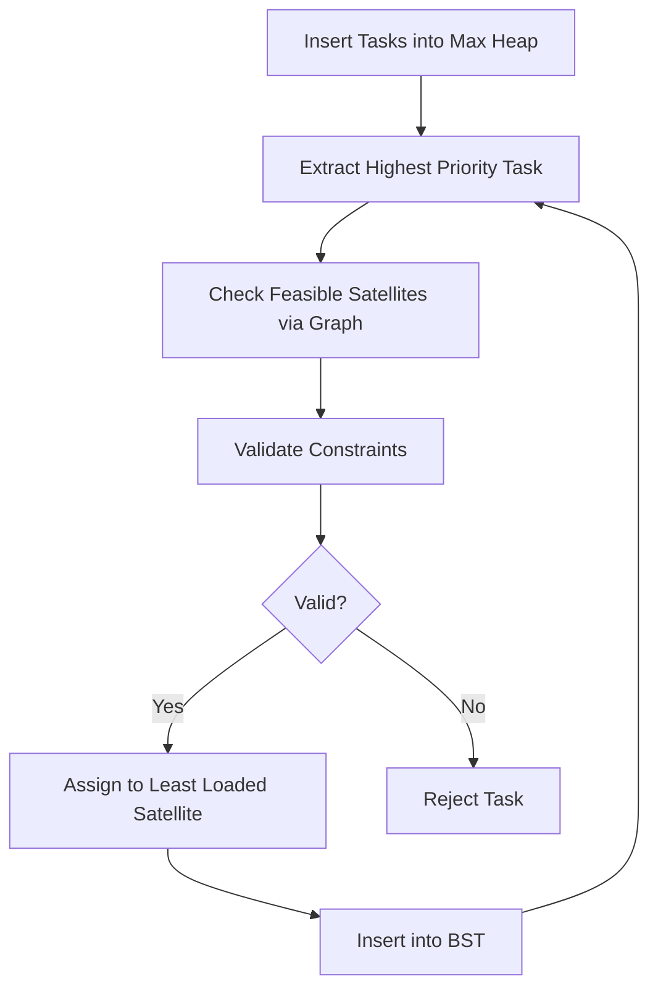
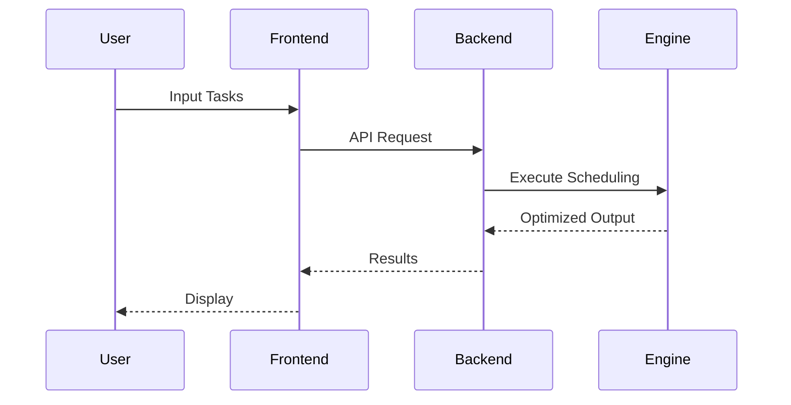
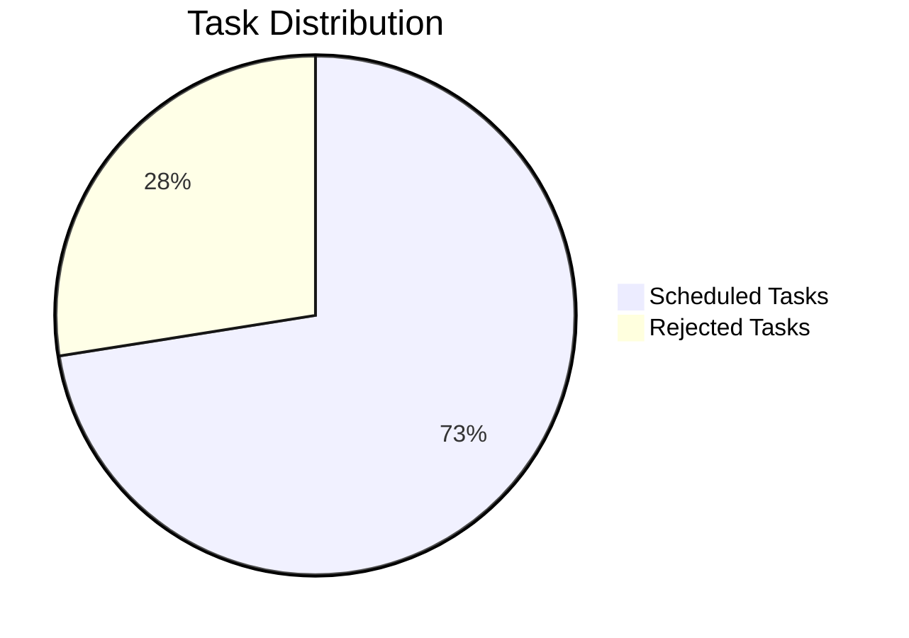
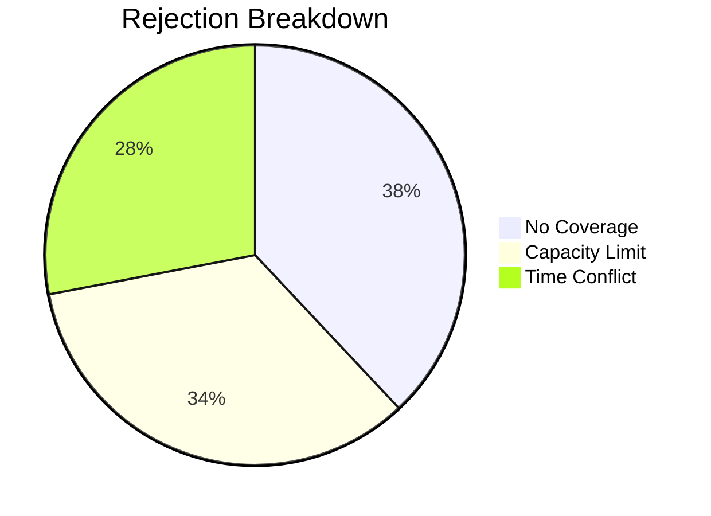

# Satellite Task Scheduling System  
### DSA-Driven Optimization Engine for Ocean Pollution Monitoring  
## Team 60 | Buffer 7.0 Hackathon

---
---

## Project Demonstration

The working prototype and system behavior can be observed in the demonstration video below:

 **Demo Video:**  
[https://drive.google.com/file/d/1-K6qMgYC6WUjQnyltsd3XeW3Ad-MKUei/view?usp=drive_link
](url)
---

## Overview

This system implements a **high-performance scheduling engine** that optimizes satellite-based monitoring using **core Data Structures and Algorithms (DSA)**.

Unlike traditional applications, this system is **algorithm-centric**, where all decisions are computed using structured data-driven logic.

---

## PROBLEM STATEMENT

### Formal Definition  

The system addresses a **constrained optimization and scheduling problem** defined over a finite set of monitoring tasks and a limited set of satellite resources.

Let:  
- **T = {t₁, t₂, …, tₙ}** represent a set of monitoring tasks  
- **S = {s₁, s₂, …, sₘ}** represent a set of satellites  

Each task **tᵢ** is characterized by:
- A **spatial attribute** (region of observation)  
- A **temporal interval** [startᵢ, endᵢ]  
- A **priority score** derived from risk, urgency, and duration  

Each satellite **sⱼ** is defined by:
- A **coverage domain**  
- A **capacity constraint**  
- A **temporal schedule**  

---

### Objective  

Determine an assignment function:

```
f: T → S ∪ {∅}
```

such that:
- Maximum high-priority tasks are scheduled  
- All constraints are satisfied  
- Scheduling efficiency is maximized  

---

### Constraints

| Constraint | Description |
| ---------- | ----------- |
| Spatial    | region(t) ∈ coverage(s) |
| Temporal   | No overlapping intervals |
| Capacity   | Limited tasks per satellite |
| Priority   | High-risk zones prioritized |

---

### Computational Insight  

This problem combines:
- **Interval Scheduling**
- **Graph-Based Filtering**
- **Greedy Optimization**
- **Priority Queue Processing**

Naïve solutions are inefficient → hence a **DSA-driven pipeline** is used.

---

## DSA-Centric Solution

| Data Structure            | Role                        |
| ------------------------- | --------------------------- |
| Max Heap (Priority Queue) | Global task prioritization  |
| Graph (Adjacency List)    | Satellite-region mapping    |
| Binary Search Tree (BST)  | Time interval scheduling    |
| Hash Map                  | Fast lookup and analytics   |
| Greedy Algorithm          | Optimal assignment strategy |

---

## System Architecture



---

### Enhanced Layered Architecture



---

## Scheduling Pipeline


---

## Detailed Execution Flow



---

## Computational Pipeline


---

## Algorithm Design

### Priority Function

```
Priority = w1 * Risk + w2 * Urgency + w3 * Duration
```

---

### Interval Conflict Detection

```
start1 < end2 AND start2 < end1
```

---

## Time Complexity Analysis

| Operation          | Complexity |
| ------------------ | ---------- |
| Heap Insert        | O(log n)   |
| Heap Extract       | O(log n)   |
| Graph Traversal    | O(V + E)   |
| BST Search         | O(log n)   |
| BST Insert         | O(log n)   |
| Overall Scheduling | O(n log n) |

---

## Data Flow Diagram


---

## System Workflow



---

## Performance Metrics

| Metric                 | Value |
| ---------------------- | ----- |
| Tasks Processed        | 120   |
| Scheduled              | 87    |
| Rejected               | 33    |
| Efficiency             | 72.5% |
| High Priority Coverage | 91%   |

---

## Performance Visualization



---

## Rejection Analysis

| Reason                | Percentage |
| --------------------- | ---------- |
| No Satellite Coverage | 38%        |
| Capacity Limit        | 34%        |
| Time Conflict         | 28%        |



---

## Satellite Utilization

| Satellite | Tasks | Utilization |
| --------- | ----- | ----------- |
| SAT-01    | 12    | 100%        |
| SAT-02    | 10    | 83%         |
| SAT-03    | 8     | 67%         |
| SAT-04    | 6     | 50%         |


---

## Key DSA Highlights

- Heap ensures global optimal ordering  
- Graph reduces unnecessary computation  
- BST guarantees fast interval conflict detection  
- Greedy approach ensures efficient allocation  
- Hash maps provide constant-time lookups  

---

## Technical Advantages

- Deterministic scheduling  
- High scalability  
- Efficient under constraints  
- Fully explainable logic  
- Strong DSA foundation  

---

## API Endpoints

| Method | Endpoint      | Description   |
| ------ | ------------- | ------------- |
| GET    | /api/health   | Health check  |
| POST   | /api/schedule | Run scheduler |
| GET    | /api/task     | Get task      |
| GET    | /api/region   | Region search |

---

## Future Enhancements

- Self-balancing trees (AVL / Red-Black)  
- AI-based priority tuning  
- Distributed scheduling  
- Real-time satellite data integration  

---

## Conclusion

This system demonstrates how **core DSA concepts can solve real-world optimization problems efficiently**.  
It highlights that strong backend logic and algorithmic design are the foundation of scalable systems.

---

## Technical Summary

The system uses a **max-heap for prioritization**, a **graph for feasibility mapping**, and a **BST for scheduling intervals**. A **greedy strategy assigns tasks** to satellites while ensuring all constraints are satisfied.

---
