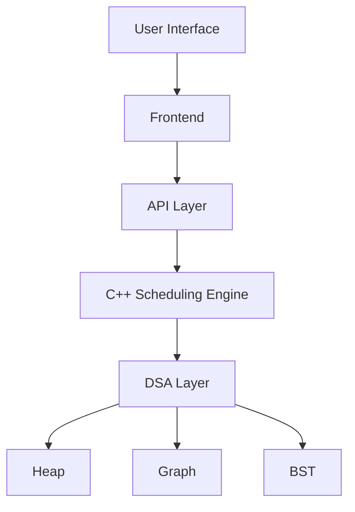
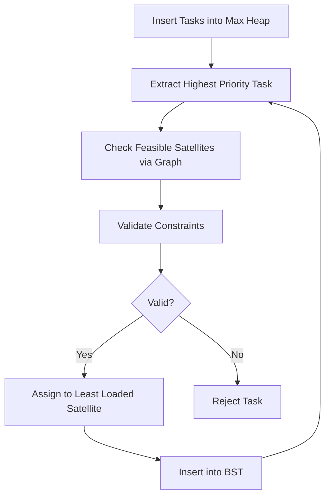
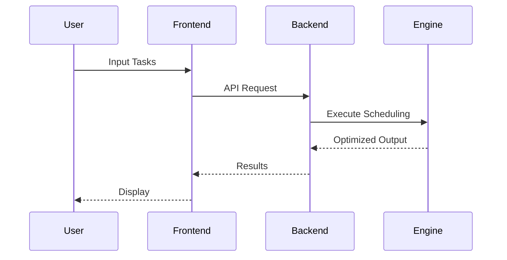

# Satellite Task Scheduling System

### DSA-Driven Optimization Engine for Ocean Pollution Monitoring

---

## Overview

This system implements a **high-performance scheduling engine** that optimizes satellite-based monitoring using **core Data Structures and Algorithms (DSA)**.

Unlike traditional applications, this system is **algorithm-centric**, where all decisions are computed using structured data-driven logic.

---

## Problem Statement

Efficiently assign monitoring tasks to satellites under strict constraints.

### Constraints

| Constraint | Description                         |
| ---------- | ----------------------------------- |
| Spatial    | Satellite must cover target region  |
| Temporal   | No overlapping time intervals       |
| Capacity   | Limited tasks per satellite         |
| Priority   | High-risk zones must be prioritized |

---

## DSA-Centric Solution

The system uses **multiple data structures working together**:

| Data Structure            | Role                        |
| ------------------------- | --------------------------- |
| Max Heap (Priority Queue) | Global task prioritization  |
| Graph (Adjacency List)    | Satellite-region mapping    |
| Binary Search Tree (BST)  | Time interval scheduling    |
| Hash Map                  | Fast lookup and analytics   |
| Greedy Algorithm          | Optimal assignment strategy |

---

## System Architecture



---

## Scheduling Pipeline


---

## Detailed Execution Flow



---

## Algorithm Design

### Priority Function

```
Priority = w1 * Risk + w2 * Urgency + w3 * Duration
```

---

### Interval Conflict Detection

```
Conflict exists if:
start1 < end2 AND start2 < end1
```

---

## Time Complexity Analysis

| Operation          | Complexity |
| ------------------ | ---------- |
| Heap Insert        | O(log n)   |
| Heap Extract       | O(log n)   |
| Graph Traversal    | O(V + E)   |
| BST Search         | O(log n)   |
| BST Insert         | O(log n)   |
| Overall Scheduling | O(n log n) |

---

## Data Flow Diagram


---

## System Workflow



---

## Performance Metrics

| Metric                 | Value |
| ---------------------- | ----- |
| Tasks Processed        | 120   |
| Scheduled              | 87    |
| Rejected               | 33    |
| Efficiency             | 72.5% |
| High Priority Coverage | 91%   |

---

## Rejection Analysis

| Reason                | Percentage |
| --------------------- | ---------- |
| No Satellite Coverage | 38%        |
| Capacity Limit        | 34%        |
| Time Conflict         | 28%        |

---

## Satellite Utilization

| Satellite | Tasks | Utilization |
| --------- | ----- | ----------- |
| SAT-01    | 12    | 100%        |
| SAT-02    | 10    | 83%         |
| SAT-03    | 8     | 67%         |
| SAT-04    | 6     | 50%         |

---

## Key DSA Highlights

* **Heap ensures global optimal ordering**
* **Graph reduces unnecessary computation**
* **BST guarantees fast interval conflict detection**
* **Greedy approach ensures efficient allocation**
* **Hash maps provide constant-time lookups**

---

## Technical Advantages

* Deterministic scheduling
* High scalability
* Efficient under constraints
* Fully explainable logic
* Strong DSA foundation

---

## API Endpoints

| Method | Endpoint      | Description   |
| ------ | ------------- | ------------- |
| GET    | /api/health   | Health check  |
| POST   | /api/schedule | Run scheduler |
| GET    | /api/task     | Get task      |
| GET    | /api/region   | Region search |

---

## Future Enhancements

* Self-balancing trees (AVL / Red-Black)
* AI-based priority tuning
* Distributed scheduling
* Real-time satellite data integration

---

## Conclusion

This system demonstrates how **core DSA concepts can solve real-world optimization problems efficiently**.
It highlights that strong backend logic and algorithmic design are the foundation of scalable systems.

---

## Technical Summary

The system uses a **max-heap for prioritization**, a **graph for feasibility mapping**, and a **BST for scheduling intervals**. A **greedy strategy assigns tasks** to satellites while ensuring all constraints are satisfied. The architecture ensures **efficient, scalable, and explainable scheduling**.
